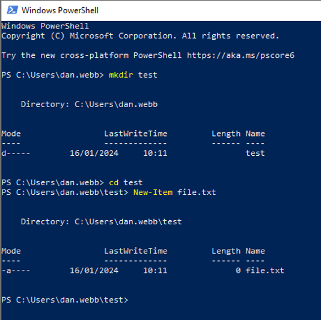
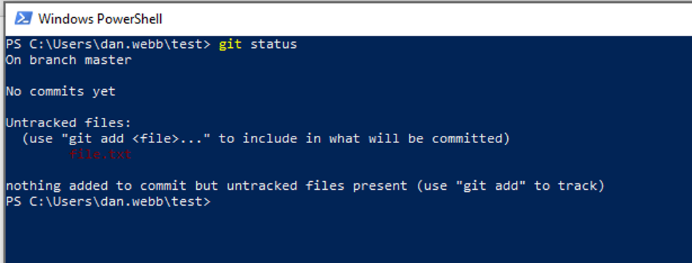
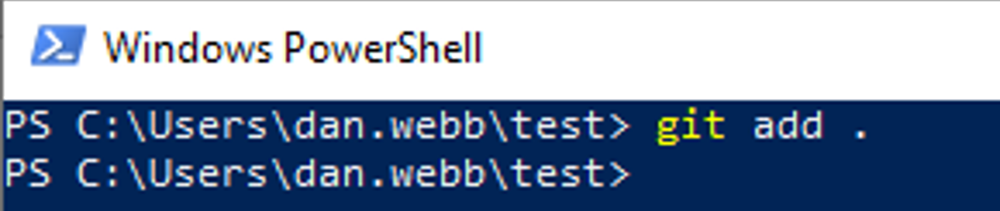
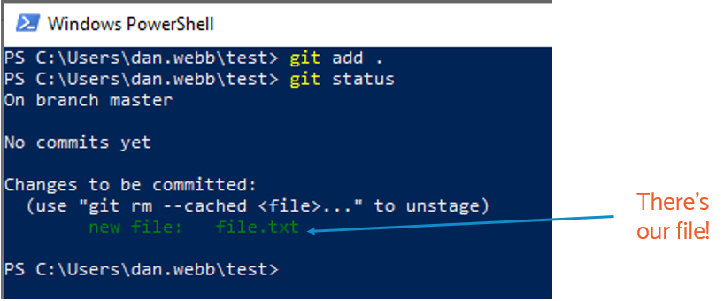
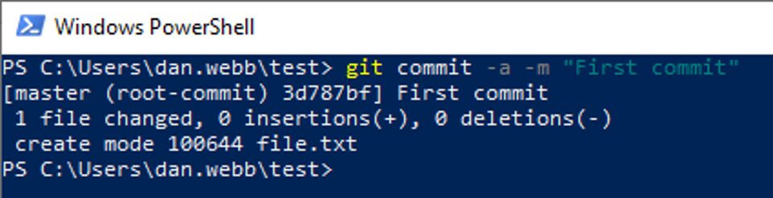
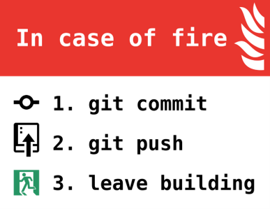
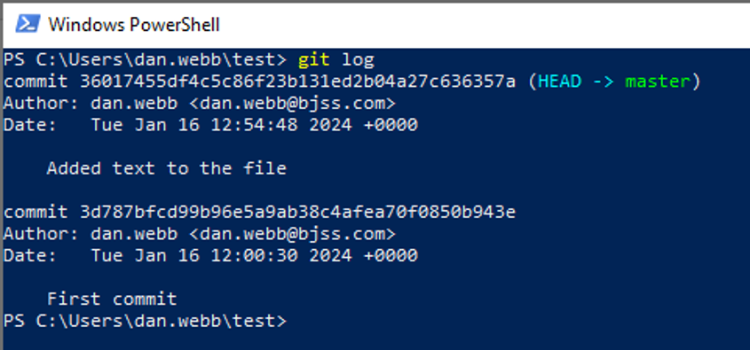
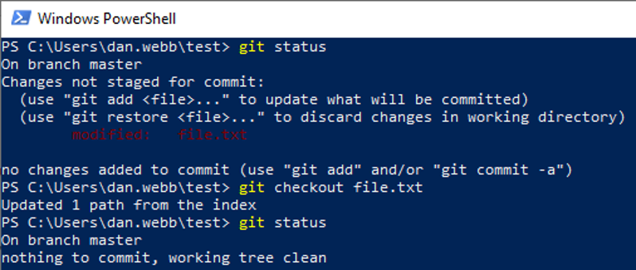

# A Quick Git Guide

Are you interested in learning to program? You might start with Python, Javascript, or any other language you prefer, and begin creating small programs or scripts.

Think of Git as a tool for saving different versions of your code as you work on it.

After completing a specific feature or chapter, you can save the current state of your code. By regularly saving your changes, you create a timeline of your work.

This "timeline" serves several purposes:

- Reverting changes: If you encounter an issue after making changes to your code, you can go back to a previous version to see what's different.
- Managing different versions: If your code is working well and you want to add a new feature that might take a while, you can create a separate version of your code to work on the new feature while keeping the current version intact.
- Collaborating with others: You can share your code and its history using platforms like GitHub, making it easier to work with others on the same project.
If all this sounds a bit confusing, don't worry. It'll become clearer as we dive into practice. Let's get started!

## Install Git

First, we need to install Git. It’s easy, I promise you, but for the sake of keeping this guide short, please head over to this very useful guide here for installation: ​

https://git-scm.com/book/en/v2/Getting-Started-Installing-Git

​All good?

## Get Started

Let’s start things out by creating a project folder and a file within that folder, and we’ll use this as our Git playground.

We’ll be using Powershell for this as I will assume you are on Windows. The commands are pretty similar for Apple, except instead of New-Item you use “touch” instead:


```mkdir test​```

``cd test​``

Windows ```New-Item file.txt​```

Apple ```touch file.txt```



## Git Init

Git will only track the projects you tell it to track, so let’s tell Git to track this project folder with ```git init```:


## Setting Up

If this is your very first time using Git, it’ll be useful to tell it your preferred username and email. We’re going to tell it, with the --global flag, to save this universally on your system so you don’t have to tell it these things again later.

> You don’t have to do this each time you use git! Just the first time on a new computer you have installed git to!

```
git config --global user.name ‘YOUR_PREFERRED_USERNAME’ 
git config --global user.email ‘YOUR_EMAIL’
```

## git status

```git status``` is probably a command you’ll be using often, to find out what files are new or changes have been made.

```git status``` will tell you what files are being tracked and whether there are changes made that haven’t been “checkedin” yet.


- Git is letting us know that nothing has been committed and that we have one untracked file. 


In this context, Git is active within the directory, yet it's not "tracking" any files at the moment. It adopts a cautious approach, and doesn't automatically track all files in a directory, and instead relies on you to specify which files to track - we'll do this next with ```git add```.

## Tracking Files With git add

We have several different ways to tell Git to track a file:

```git add FILENAME ```
You can explicitly tell it to track a file by giving it the filename. 

```git add FILENAME FILENAME FILENAME FILENAME ```
You can track multiple files by listing multiple filenames. 

```git add .``` 
You can all files in the current directory and its subdirectories to be tracked.

> You'll probably use ```git add .``` more than anything else, especially when starting. It's a good way to ensure any new files you have created are tracked by git. Nothing worse than sharing your code and realising you forgot to include a file!

Earlier you created a file in your test directory (file.txt) — now, add it to your Git repository (otherwise known as a repo):



You'll notice there's no confirmation of what has happened, but it has worked. You can check by running ```git status``` again:



Now that we are tracking our file, it's time to create our first piece of history in our timeline by creating a *commit*.

## Save Your Current Status With git commit

Let’s commit our current status into the Git history, and write a message to go along with it: 

```git commit -a -m "First commit"```



(Your numbers will be different, but otherwise this should look very similar.)

We are using two "flags" afetr git commit:
- **-a** tells git to commit all files that are *currently* being tracked. Remember, new files will still need to be added with ```git add``` first.
- ***-m*** tells git that we want to include a message. We should include a message about what the commit is every time.

> Commit messages should be explanatory. Often they will be very mundane "fixed broken hyperlin on homepage for defect #999", but this allows us to keep track between commits and get that whole history of what has been done, when, and by who.

If you run git status again now git will tell you everything is normal and you are up-to-date:


## What Next?

Ok, now we have started tracking our files (using ```git add```) and have committed our code (using ```git commit```), we can carry on working on the next piece of functionality.

It's important to add and commit quite regularly - this way you can go back in time in your history if you massively screw up your code, or get the latest code back if your computer suffers a terminal crash.



Working for days or weeks without committing your code is less helpful than small, regular updates throughout your day - partly because it becomes harder to undo bad things and your commit is very large, so anyone looking at it will have to do a lot of mental gymnastics comparing between your "old" commit and your "new" commit.

Let's do a second commit so you can get a feel for it.

## Your Second Commit

Open up file.txt in your favourite text editor and add some new text into it, and save the file.

If you now run ```git status``` you will see the file has been modified:


Commit the file using ```git commit –a –m “your commit message”```


## Looking at the History With git log

Whilst you probably won't use this very often, it's useful for looking at your history of commits. Type ```git log``` into the terminal:



Here we can see our two commits so far, with the newest at the top, along with the messages we used.

## Help, I've Made Changes I Don't Want To Commit!

Relax, gitr has got you covered. SOmetimes you start work on somethign and it turns out all that work was rubbish and you are no longer sure what changed.

### I've only made changes to one file I want to revert

You can try this for yourself. Open file.txt again and add a new line to the file - any random text will do - and save the file.

Now if you run ```git status``` you will see that one file is listed under "Changes not staged for commit".

To revert this change back to the latest version you committed, you can use ```git checkout FILENAME```:



Running git status again shows us the working tree is now clean - or in plain English, we're all back where we were at our last commit.


### I've made lots of changes and I want to just go back fully to the previous commit

Naughty. Anyway, if you've gone too far down the rabbit hole of trying to fix things but have made too many changes and want to go back to your last commit you can use ```git reset --hard HEAD```.
