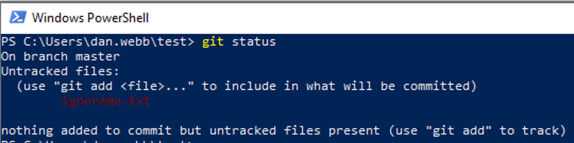
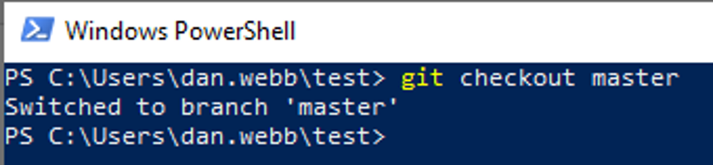
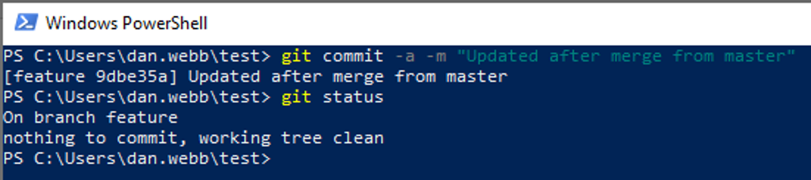

# A Quick Git Guide

Are you interested in learning to program? You might start with Python, Javascript, or any other language you prefer, and begin creating small programs or scripts.

Think of Git as a tool for saving different versions of your code as you work on it.

After completing a specific feature or chapter, you can save the current state of your code. By regularly saving your changes, you create a timeline of your work.

This "timeline" serves several purposes:

- Reverting changes: If you encounter an issue after making changes to your code, you can go back to a previous version to see what's different.
- Managing different versions: If your code is working well and you want to add a new feature that might take a while, you can create a separate version of your code to work on the new feature while keeping the current version intact.
- Collaborating with others: You can share your code and its history using platforms like GitHub, making it easier to work with others on the same project.
If all this sounds a bit confusing, don't worry. It'll become clearer as we dive into practice. 

## Install Git

First, we need to install Git. It’s easy, I promise you, but for the sake of keeping this guide short, please head over to this very useful guide here for installation: ​

https://git-scm.com/book/en/v2/Getting-Started-Installing-Git

​All good?

## Get Started

Let’s start things out by creating a project folder and a file within that folder, and we’ll use this as our Git playground.

We’ll be using Powershell for this as I will assume you are on Windows. The commands are pretty similar for Apple, except instead of New-Item you use “touch” instead:


```mkdir test​```

``cd test​``

Windows ```New-Item file.txt​```

Apple ```touch file.txt```


## git init

Git will only track the projects you tell it to track, so let’s tell Git to track this project folder with ```git init```:


## Setting Up

If this is your very first time using Git, it’ll be useful to tell it your preferred username and email. We’re going to tell it, with the --global flag, to save this universally on your system so you don’t have to tell it these things again later.

> You don’t have to do this each time you use git! Just the first time on a new computer you have installed git to!

```
git config --global user.name ‘YOUR_PREFERRED_USERNAME’ 
git config --global user.email ‘YOUR_EMAIL’
```

## git status

```git status``` is probably a command you’ll be using often, to find out what files are new or changes have been made.

```git status``` will tell you what files are being tracked and whether there are changes made that haven’t been “checkedin” yet.


- Git is letting us know that nothing has been committed and that we have one untracked file. 


In this context, Git is active within the directory, yet it's not "tracking" any files at the moment. It adopts a cautious approach, and doesn't automatically track all files in a directory, and instead relies on you to specify which files to track - we'll do this next with ```git add```.

## Tracking Files With git add

We have several different ways to tell Git to track a file:

```git add FILENAME ```
You can explicitly tell it to track a file by giving it the filename. 

```git add FILENAME FILENAME FILENAME FILENAME ```
You can track multiple files by listing multiple filenames. 

```git add .``` 
You can all files in the current directory and its subdirectories to be tracked.

> You'll probably use ```git add .``` more than anything else, especially when starting. It's a good way to ensure any new files you have created are tracked by git. Nothing worse than sharing your code and realising you forgot to include a file!

Earlier you created a file in your test directory (file.txt) — now, add it to your Git repository (otherwise known as a repo):


You'll notice there's no confirmation of what has happened, but it has worked. You can check by running ```git status``` again:


Now that we are tracking our file, it's time to create our first piece of history in our timeline by creating a *commit*.

## Save Your Current Status With git commit

Let’s commit our current status into the Git history, and write a message to go along with it: 

```git commit -a -m "First commit"```


(Your numbers will be different, but otherwise this should look very similar.)

We are using two "flags" afetr git commit:
- **-a** tells git to commit all files that are *currently* being tracked. Remember, new files will still need to be added with ```git add``` first.
- ***-m*** tells git that we want to include a message. We should include a message about what the commit is every time.

> Commit messages should be explanatory. Often they will be very mundane "fixed broken hyperlin on homepage for defect #999", but this allows us to keep track between commits and get that whole history of what has been done, when, and by who.

If you run git status again now git will tell you everything is normal and you are up-to-date:


## What Next?

Ok, now we have started tracking our files (using ```git add```) and have committed our code (using ```git commit```), we can carry on working on the next piece of functionality.

It's important to add and commit quite regularly - this way you can go back in time in your history if you massively screw up your code, or get the latest code back if your computer suffers a terminal crash.


Working for days or weeks without committing your code is less helpful than small, regular updates throughout your day - partly because it becomes harder to undo bad things and your commit is very large, so anyone looking at it will have to do a lot of mental gymnastics comparing between your "old" commit and your "new" commit.

Let's do a second commit so you can get a feel for it.

## Your Second Commit

Open up file.txt in your favourite text editor and add some new text into it, and save the file.

If you now run ```git status``` you will see the file has been modified:


Commit the file using ```git commit –a –m “your commit message”```


## Looking at the History With git log

Whilst you probably won't use this very often, it's useful for looking at your history of commits. Type ```git log``` into the terminal:


Here we can see our two commits so far, with the newest at the top, along with the messages we used.

## Help, I've Made Changes I Don't Want To Commit!

Relax, gitr has got you covered. SOmetimes you start work on somethign and it turns out all that work was rubbish and you are no longer sure what changed.

### I've only made changes to one file I want to revert

You can try this for yourself. Open file.txt again and add a new line to the file - any random text will do - and save the file.

Now if you run ```git status``` you will see that one file is listed under "Changes not staged for commit".

To revert this change back to the latest version you committed, you can use ```git checkout FILENAME```:


Running git status again shows us the working tree is now clean - or in plain English, we're all back where we were at our last commit.


### I've made lots of changes and I want to just go back fully to the previous commit

Naughty. Anyway, if you've gone too far down the rabbit hole of trying to fix things but have made too many changes and want to go back to your last commit you can use ```git reset --hard HEAD```.

## I've Got Some Files I Don't Want To Commit, Ever

Often there will be certain files you don't want to commit. Most of the time these will be things that make it work on your computer such as plugins or packages, or IDE specific things for our own setup that we don't want to share.

To do this, we can specify create a file called .gitignore that tells git which files or folder to never worry about tracking or committing.

To test this out, create a new file in the same folder as ```file.txt``` called ```ignoreme.txt```.

First, check that git knows it's there as an "untracked" file:



Next, create a ```.gitignore``` file and put it at the root of your project, where your ``.git ``directory is. Within the ```.gitignore``` file, put “ignoreme.txt” at the top of the file and save. 

If we run git status again, we can see that the .gitignore file was added, but the ignoreme.txt file is no where to be found. Git is successfully ignoring that file! 


Now, if we run ```git status``` again we will see that .gitignore is untracked, but the ignoreme.txt fiel is nowhere to be found - git is successfully ignoring the file.


## .gitignore File For Your Project

Fortunately you don't have to do a lot of this as there are ready made .gitignore files available online: https://github.com/github/gitignore  

****

# Branching

So far, we've just been commiting to the main, or master, branch. This is the default branch every repository starts with.

This is fine if you are just working on your own (or if you are doing Trunk Based Delivery, but that's a whole other course...) and on small projects.

However, imagine you want to experiment with some new features, or you aren't sure if your new changes are going to work. Or you want to change something but don't want it in you main branch just yet until you have finished working on it.

This is where branching comes in - it allows you to keep different version of your project in different states until you bring them together (known as merging, which we will cover later).

In the diagram below, you can see we have released version 1 of the code, and then create a new branch to work on a feature (a certain subset of functionality).

[^1]

You'll also see that we had to fix a bug on our main branch. This bug fix doesn't make any changes to our feasture branch, and our feature branch doesn't make any changes to our main branch. This allows us to keep non-ready code separate and not deploy partial code to our users.

> There are other ways, called *feature flags* but we will not be discussing that here.

## Create A Branch

Run the command ```git checkout -b feature ```in your terminal to create a new branch named “feature”.

> The **-b** is important here, it's the flag that says "I want to create a new branch".


## What Branch Am I On? What Branches Do I Have?

If you need to remind yourself what branches you’ve created, run the command
```git branch```. This will also show you which branch you are currently on:


## Switching Branches

Now that we can see what branches are available with ```git branch```, we can switch between the two with ```git checkout BRANCHNAME```:



> Note there is no **-b**; not having that says "I want to *move* to this branch" rather than "I want to *create* a new branch named X"

> Switching between branches allows us to work on multiple versions of the code on one computer.

## Applying Changes From One Branch To Another With git merge

When you have finished your changes on a branch (such as feature) and want to apply them to another branch such as main, you can use ```git merge``` to combine the two branches together in your *current* branch.

> Key point here, you always merge *into* your current branch *from* the target branch


To test this out, make some changes on your “feature” branch (remember to switch to the feature branch if you are not already on it!) – here I have added a line of text to the file.txt and saved it:


Now I commit the changes, then move back to the “master” branch by running the command ```git checkout master```.

> Before we do anything else - I'll prove to you that the changes we made in feature are not there now we have switched branches to a different version - open up ```file.txt``` and you'll see the changes we made are not there.

Now I can bring all the changes made to the feature branch over to the master branch with ```git merge BRANCHNAME``` (```git merge feature``` if your branch was named “feature”).


You have now merged your feature branch *into* you master branch. You can check this by opening ```file.txt``` and seeing the changes.

## Conflicts!

Now git will often be able to handle merges from one branch to another without problems. However, when it doesn't know how to merge any two files it's going to cause a *conflict*.

The reason for this is normally if the same file has been changed by two users in the same place in the file.

So now we are going to make a conflict to show you what happens.

Firstly, on the master branch (which you should still be on, but check with ```git branch```), we are going to update our ```file.txt```, save the file, and commit the changes. Secondly we are going to switch to the feature branch, update the ```file.txt``` with *different* text in the same place, and save it.


Now, on our feature branch, we commit our changed file, and attemp to merge from ther master branch:


Git also helpfully tells you which file(s) are in conflict - only one in this case, ```file.txt```.

Git will have added ```<<<<<``` and ```>>>>>``` marks around where there is a conflict, with ```=======``` in between, and will include both versions of the conflicted code, so you can manually pick and choose what to keep and what to lose:


Here ```<<<<<<< HEAD``` indicates the code in our *current* branch (feature) and ```>>>>>>> master``` indicates the changes on the branch we are merging *from* (master).

We can resolve this by manually merging the two in the file:


We’ve removed the ```<<<<<< Head``` and ```======``` and ```>>>>>>> master``` lines and saved the changes we want to make.

Now we have to commit the changes to our branch:



You can even now switch back to the master branch and merge the feature branch into it without issue.

## git stash

Git will moan if you have changes on a branch that you *haven't* committed and try to switch branches. It doesn't want to assume you want to bring those changes with you, so makes you make a decision - do you want to commit these changes, remove these changes, or *save them for later without doing a full commit*.

```git stash``` helps you temporarily set aside your work so you can deal with something else, and then easily pick up where you left off when you're ready. It's like a pause button for your changes.

This tells git to move your changes to an inivisible branch or holding pen (they won;t even show up if you run git status), and allows you to move back and forth between branches again.

When you want those changes back you can run ```git stash pop```. 

> This works on *any* branch, not just the original branch those changes were on. This is extremely useful if you started making changes on a branch, realised you were on the wrong branch - you can stash your changes, switch to the correct branch and run ```git stash pop``` to bring the changes into the new branch.

***

# Sharing Your Code

Whilst that was all very good, it's not much help if we need to share our code with others. The code only exists on our machine right now, in something known as a "repository" or "repo".

When you ran ```git init``` what you actually did was initialise a git repository on your computer - known as you *local repository*.

Most repositories you will see will be on the internet on websites like GitHub. You can share your code like this too in what is known as a *remote repository*.

Remote repositories allow teams to share code - everyone can *push* their changes to this, and you can see other people's changes by *pulling* the latest version down to your local repository.

## Create A Github Profile

First things first, we are going to need a remote repository. Head over to GitHub to create a profile first: https://github.com/ 

## Create A Repository

Click the Create repository button once you have created a profile and signed in:


Now you'll need to name your repository. We're going to call ours "profile", but you can name it whatever you like.

Make sure your repository is set to Public so other people can see it! Otherwise accept all the other defaults:


Once you have done this, you'll get shown the link to the respository. Copy this link to the clipboard.


## Add The Remote Repository

On the command line in your git project, type the following, remembering to replace \<REMOTE_URL> with the link you copied in the previous step:

```git remote add origin <REMOTE_URL>```

### Placeholders

Quite a lot of the time, people will use the syntax \<something> as a placeholder e.g.:
- Enter your \<password>
- Add the \<remote url> to the command

> This means they want you to replace the entire placeholder *including* the angle brackets with the value.

They do not mean “please enter your placeholder value inside these angle brackets”

## Verify

Verify you have successfully added the remote by using ```git remote -v```


# Other Help

## Exiting VIM

If you don’t add a message, Git will open up an editor (using vim by default, which can be confusing to learn). So remember to always add a message when committing, even if it’s “WIP” (and if you get stuck in the vim editor, type :```wq``` to leave.)

## Removing Files

The command ```git rm FILENAME``` will remove the file both from Git and from your computer. You’re *deleting* the file. 

If you want to just remove the file from Git but keep the file on your computer, you’ll need to pass in the --cached flag. 

So: ```git rm --cached FILENAME```

This isn’t something that should be run often at all, but useful to know just in case.

[^1]: Credit: Tracey Osborn